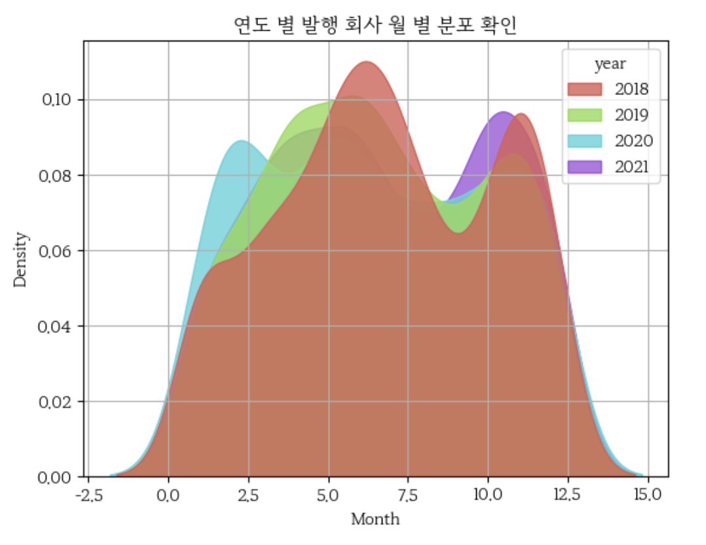
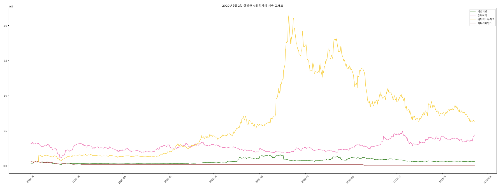
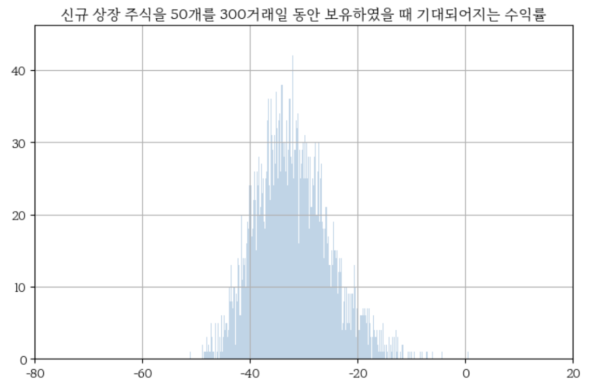

# KRX Market New Listing Stock Price Flow Analysis

<h1 align="center"> Stock Price Flow Analysis </h1>

<h5 align="center"> Time series analysis Project  (2023-03 ~ ing) </h5>

* This project is still ongoing and being updated. 

 
<h3> Project Instruments </h3>

최근 들어 신규 상장 불패 신화 관련, 뉴스가 많이 들려오고 있습니다. 또한, 한때 공모주 열풍이 불기도 하였습니다.
그렇다면, 진짜로 공모주는 불패 신화일까?에 대해 분석하여 공모주 선택 및 공모주 상장일 이후 언제쯤 매도하는 것이 최고의 수익을 볼 수 있는지 예측하는 최종 프로젝트를 하고자 합니다.

There's been a lot of news lately about the myth of the unbeatable IPO, and there was even a public stock craze at one point.
For my final project, I would like to analyze when it is best to sell after the IPO date.
 

<h3> Project Goals </h3>

KRX 신규 상장 주식을 분석하여 어떠한 종류의 공모주를 선택하는 것이 좋은지, 언제 파는 것이 좋은지에 대한 분석 진행 및 모델을 개발하여 현명한 주식 투자를 하고자 합니다.

We want to make smart stock investments by analyzing KRX newly listed stocks and developing models on what kind of public stocks to choose and when to sell.

또한, 투자중인 공모주에 대해 분석하여 알맞는 판단 및 판매 시기를 정하도록 합니다.

It also analyzes the publicly traded stocks you're investing in to help you make the right decisions and time to sell.
 

<h3> Methods </h3>
공공 데이터 포털에서 KRX 주식 시세 정보를 수집합니다. 투자 공모주 종목 선정을 위해서 각 종목에 해당하는 회사의 분야, per, 보호수량, 현금, 매출, 수익, 거래량, 토론방의 댓글 등을 통하여 종목을 선정합니다.

그리고, 시세 흐름 분석을 통해 앞으로 주가는 어떻게 될지 예측합니다.

We collect KRX stock quotes from public data portals. To select stocks for public offering, we analyze each company's sector, PER, number of shares reserved, cash, sales, earnings, trading volume, and comments in the discussion board.

Then, we analyze the price flow to predict the stock price in the future.
 

<h1> Datasets </h1>

##### 공공데이터포털 - 금융위원회_주식정보서비스([https://www.data.go.kr/iim/api/selectAPIAcountView.do](https://www.data.go.kr/iim/api/selectAPIAcountView.do))

##### 공공데이터포털 - 금융위원회_주식시세정보([https://www.data.go.kr/iim/api/selectAPIAcountView.do](https://www.data.go.kr/iim/api/selectAPIAcountView.do))

한국거래소에서 제공하는 주식시세 정보
주식시세, 수익증권시세, 신주인수권증권시세, 신주인수권증서시세에 대한 오퍼레이션을 제공한다.

Stock quotes provided by the Korea Exchange
Provides operations for stock quotation, revenue stock quotation, warrant stock quotation, and warrant certificate quotation.

##### KRX한국거래소 - 신규상장기업현황([https://kind.krx.co.kr/listinvstg/listingcompany.do?method=searchListingTypeMain](https://kind.krx.co.kr/listinvstg/listingcompany.do?method=searchListingTypeMain))

##### KRX한국거래소 - 공모기업현황([https://kind.krx.co.kr/listinvstg/pubofrprogcom.do?method=searchPubofrProgComMain](https://kind.krx.co.kr/listinvstg/pubofrprogcom.do?method=searchPubofrProgComMain))

##### 네이버증권 ([https://finance.naver.com/](https://finance.naver.com/))
 

 
<h1> File Description </h1>
 
<b>1. KRX_Market_New_Listings_Analysis </b> - 공공데이터 포털에서 api를 이용해 18 ~ 22년도 데이터를 수집하여 KRX 시장에 신규 상장한 주식 데이터를 정리합니다. KRX상장의 시계열성을 확인 및 데이터 프레임을 분석합니다.

Organize the data of newly listed stocks on the KRX market by collecting data from 18 to 22 years using APIs from the public data portal. Check the time series of KRX listings and analyze the data frame. 
 

 

* 모든 연도에서 월별 주식 상장의 시계열성은 비슷한 것을 확인할 수 있으며, 특정 달에 많은 회사가 상장하는 것을 확인할 수 있습니다.

 
<b>2. Analyzing_the_Market_Flow_of_Newly_Listed_Stocks_in_20-21 </b> - 공공데이터 포털에서 api를 이용해 KRX시장 18년도부터의 주식 시세를 데이터 프레임화합니다. 한국거래소에서 기업들의 신규상장기업 현황을 데이터프레임화합니다. 두 개의 데이터프레임을 이용하여 20~21년도에 KRX에 상장한 주식의 시세흐름을 분석합니다.

Data frame stock quotes from KRX market since 2018 using API from public data portal. Create a data frame of companies' initial public offerings on the Korean Exchange. Analyze the price flow of stocks listed on KRX in 20-21 using two data frames. 

 

  
* 2021년 1월 2일에 상장한 3개의 신규 상장 주식의 시총 흐름을 확인합니다.

  
<b>3. Analyze_the_profitability_of_newly_listed_stocks </b> - 위에서 만든 데이터프레임을 이용하여 20~21년도 신규 상장 주식을 가지고 있었을 때의 수익을 분석합니다. 

Using the dataframe created above, analyze the returns of owning a newly listed stock in 20-21. 

 

* 신규 상장 주식을 랜덤으로 50개를 300거래일 동안 보유하였을 때 기대되어지는 수익률 히스토그램입니다.
* 20~21년도에 상장한 주식 중 300거래일이 있는 주식만을 분석하였으며, 50개를 가지고 있었다면 평균 수익률은 거의 대부분 마이너스를 기록합니다.

<h1> To do List </h1>

1. 각 어떠한 특성을 가지고 있는 공모주가 상장한 첫째날의 수익성에 대해 분석을 진행합니다.
분석 진행 후, 상장 첫째날의 공모주가 오를지에 대해 예측하는 모델을 개발합니다.
 

2. 각 상장한 신규 공모주들의 주식 시세 흐름 분석을 진행하고, 주가 예측 모델을 개발합니다.

* side project
포트폴리오에 여러 주식을 담을 수록 수익성은 예금과 유사해지는지 확인합니다.
이때, 주식은 여러 분야 혹은 단일 분야로 설정하고 비교를 진행합니다.

<h1> Method </h1>

 
1. 공공 데이터 포털 금융위원회_주식시세정보, KRX한국거래소 - 공모기업현황, pykrx 모듈, 네이버 증권 종목 토론방 텍스트 데이터를 수집합니다. 

네이버 증권은 크롤링을 통해서 정보를 수집합니다. pykrx 사용법은 ([LINK](https://github.com/sharebook-kr/pykrx))를 참고해서 이용합니다. 수집한 데이터를 하나의 데이터프레임으로 생성합니다.

 
2. 위에서 만든 데이터프레임을 이용하여 공모주의 상장한 날의 주가 흐름을 분석합니다. 그리고 회귀 모형을 이용하여 상장날 종가를 예측합니다. 

 
3. 위에서 만든 데이터프레임을 이용하여 신규 상장 주식의 주가 흐름 분석을 진행하며 주가 예측 모델을 LSTM model을 이용하여 개발합니다. 

 
4. (side) 신규 상장 공모주에 대하여 종목을 여러개 가지고 있을 경우, 예금의 금리 수익성과 비슷하다는 가설을 설정하고 분석합니다. 이 때, 실험은 종목의 개수, 종목 분야의 다양성(2차전지, 의료, 식품, IT 등등)등을 바꿔가며 진행합니다.  

<h1> Expectations </h1>

`공모주에 공모하기 앞서 좀 더 수익성이 기대되어지는 공모주를 선별하여 투자할 수 있습니다.`
`공모주에 매도 시기를 결정하는데 도움을 줄 수 있습니다.`
`주식 투자간 포트폴리오 구성에 있어서 도움을 줄 수 있습니다.`